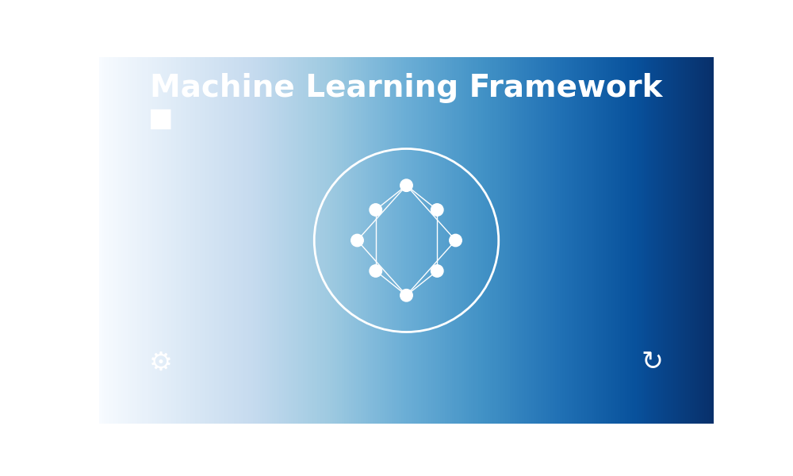

	

A meta library to speed up ml tasks I have repeated in the past.

## Project Tasks (TODO)

Completed

 <ul>
  <li>None so far</li>
     
</ul> 

Near term

 <ul>
  <li>Setup common project files</li>
  <li>Setup repo architecture</li>
  <li>Create common trainer/evaluator objects</li>
  <li>Add common visualization code</li>
  <li>Add a few examples of training using previous functionality</li>
</ul> 

Long term

 <ul>
  <li>Finalize repo architecture</li>
  <li>Make trainer/evaluator objects feature rich</li>
  <li>Make visualizations asthetic and more diverse</li>
</ul> 

## Development

Development is taking place jupyter lab, I'm using {INSERT} for linting. If you see something I should address, give a shoutout in the issues and I'll address it asap.

There will be some utility files while development is more active which I will remove as the project matures